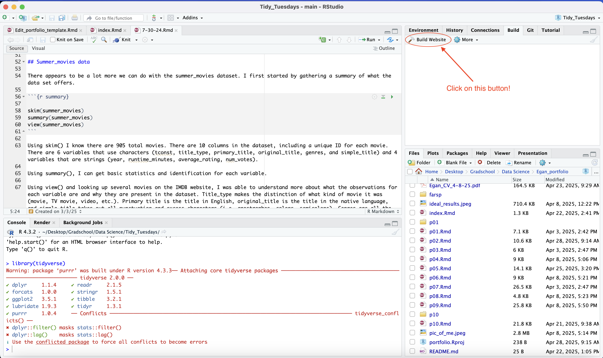

```{r setup, warning = FALSE, message=FALSE}
library(tidyverse) 
```

There are several different ways you can upgrade your portfolio template. Follow along for a walkthrough of the template and extra features you can add to improve upon the template!

## General orientation to the template

Start by opening up the folder of your template and glancing through each of the files. This can help provide a general orientation to the different types of files. Notice there are lots of .Rmd files, a .yml file, and .Rproj file. 

### .Rproj

The `.Rproj` file is a project file. Project files make it relatively easy to create a working directory and orient your computer to access all the files needed within the project. You'll encounter `.Rproj` files over the course of the semester in each of the weekly assignments. By opening the project file, you tell your computer the exact files that are necessary for the current project. To open a project: <br/> <br/>

1. Use the **Open Project** command (available by selecting File -> Open Projects) to select the current project file
2. Select the project from the list of recent projects, located by selecting File -> Recent Projects
3. Double clicking on `.Rproj` within your computer's system (e.g. Windows Explorer, OSX Finder, etc.)

#### Why use `.Rproj`?

The benefit of using the project is that you gain access to building your portfolio website. Located in the top right, you can use the build website button to see all portfolio pieces knitted together. Don't worry if you haven't completed all portfolio pieces, those tabs will remain blank until your magnificent pieces are created. If you can't find the button, make sure you've clicked on the "Build" tab.



### Files with .Rmd

You are probably very familiar by now with `.Rmd` files because of the course. If not, they are R Markdown files. R Markdown files allow you to create interactive documents. By creating chunks using ```, you can incorporate code alongside commentary. To view the R Markdown files, use the "Knit" button located at the top of the document.

Each portfolio peice will be named `p##.Rmd` and correspond to the portfolio piece number. The `index.Rmd` file is the homepage of the website and the `about.Rmd` file corresponds to the about tab.

### .yml

The `.yml` file is the backbone of the website. If you take a look through the file, you can see that the file is the location for the heading bars at the top of the website and stitches all the `.html` files into the website. You can edit the headers by changing the text in the `.yml` file.

## Extra additions to personalize your website

This was a bare bones walk through of the website. There are lots of ways you can customize your website to make it more personal to yourself.

### Colors

Located within this folder, there is a file called `Aesthetics.css`. To change the colors, move this file into your portfolio file and add "css: Aesthetics.css" to the bottom of the `.yml` file. I made them ugly and very contrasting colors to help you identify the relationships between each color and the corresponding code. Play around and find colors that best suit your personality. 

### Adding links

On the home page, you can add in links to both within your own website or to outside website (e.g. the course webpage, tidy Tuesday links, etc.). 

**For any link** you want to embed into a file, you will place brackets [] directly in front of/touching parentheses (). The brackets will contain the corresponding words or phrases you want to be represented by the hyperlink while the parenthesis will contain the acutal link. For example, [This is the link for the data sceince homepage](https://datascience4psych.github.io/DataScience4Psych).

As mentioned, you can also **link to other pages** within the portfolio website. This will be the same process, but instead you'll link to the `.hmtl` file instead of a standard link [e.g. (p03.html), (p10.html) ].

Finally, you can **link to other files** (e.g. your resume/CV). I personally have only tried this with pdf files, but play around and see if you can include more complex files or folders. The key is to drop whatever file you are trying to link into the portfolio folder. This will work the same as before, but instead of a standard link you'll include the name of the file [e.g. (resume-4-12.pdf) ].

### Adding images

As you can see already, you can add in images to spice up your portfolio pieces. The syntax will be similar to the links, but instead you'll include a ! before the brackets. If you want to see the full syntax, look at the image I included above.