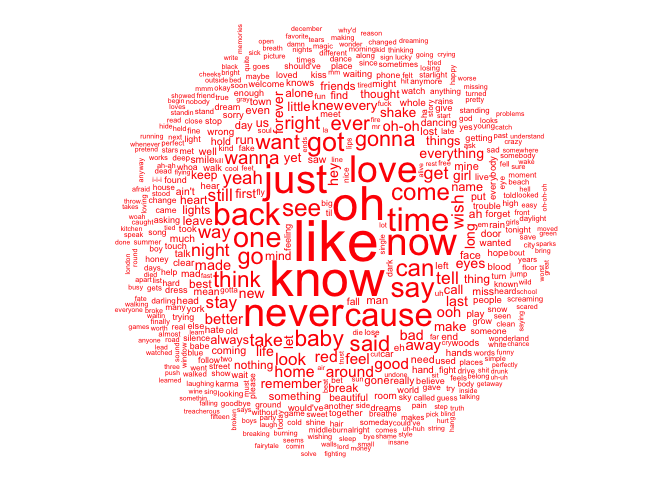

Portfolio 3
================
Thomas Huang
2026-03-06

This piece reflects something fancy I recently learned, creating a word
cloud in R. I will use the taylor package as the source of my data. Some
text analyses in this piece builds on one of my undergraduate course
project.

## Load packages

``` r
library(taylor);library(tidyverse);library(tidytext);library(quanteda);library(quanteda.textplots)
```

    ## Package version: 4.3.1
    ## Unicode version: 14.0
    ## ICU version: 71.1

    ## Parallel computing: disabled

    ## See https://quanteda.io for tutorials and examples.

## Extract data

``` r
data(taylor_album_songs)
glimpse(taylor_album_songs)
```

    ## Rows: 332
    ## Columns: 26
    ## $ album_name          <chr> "Taylor Swift", "Taylor Swift", "Taylor Swift", "T…
    ## $ ep                  <lgl> FALSE, FALSE, FALSE, FALSE, FALSE, FALSE, FALSE, F…
    ## $ album_release       <date> 2006-10-24, 2006-10-24, 2006-10-24, 2006-10-24, 2…
    ## $ track_number        <int> 1, 2, 3, 4, 5, 6, 7, 8, 9, 10, 11, 12, 13, 14, 15,…
    ## $ track_name          <chr> "Tim McGraw", "Picture To Burn", "Teardrops On My …
    ## $ artist              <chr> "Taylor Swift", "Taylor Swift", "Taylor Swift", "T…
    ## $ featuring           <chr> NA, NA, NA, NA, NA, NA, NA, NA, NA, NA, NA, NA, NA…
    ## $ bonus_track         <lgl> TRUE, TRUE, TRUE, TRUE, TRUE, TRUE, TRUE, TRUE, TR…
    ## $ promotional_release <date> NA, NA, NA, NA, NA, NA, NA, NA, NA, NA, NA, NA, N…
    ## $ single_release      <date> 2006-06-19, 2008-02-03, 2007-02-19, NA, NA, NA, N…
    ## $ track_release       <date> 2006-06-19, 2006-10-24, 2006-10-24, 2006-10-24, 2…
    ## $ danceability        <dbl> 0.41, 0.43, 0.45, 0.48, 0.44, 0.44, 0.49, 0.48, 0.…
    ## $ energy              <dbl> 0.35, 0.41, 0.32, 0.38, 0.35, 0.40, 0.36, 0.34, 0.…
    ## $ loudness            <dbl> 0.22, 0.13, 0.25, 0.14, 0.21, 0.12, 0.15, 0.23, 0.…
    ## $ acousticness        <dbl> 0.95, 0.91, 0.96, 0.94, 0.95, 0.93, 0.95, 0.95, 0.…
    ## $ instrumentalness    <dbl> 0.75, 0.75, 0.76, 0.74, 0.75, 0.74, 0.74, 0.75, 0.…
    ## $ valence             <dbl> 0.78, 0.80, 0.48, 0.79, 0.78, 0.50, 0.80, 0.50, 0.…
    ## $ tempo               <dbl> 76.00, 105.47, 99.38, 114.84, 87.59, 112.35, 143.5…
    ## $ duration_ms         <int> 232106, 173066, 203040, 199200, 239013, 207106, 24…
    ## $ explicit            <lgl> FALSE, FALSE, FALSE, FALSE, FALSE, FALSE, FALSE, F…
    ## $ key                 <int> 0, 2, 5, 9, 0, 5, 4, 8, 2, 9, 9, 3, 7, 11, 10, 5, …
    ## $ mode                <int> 1, 1, 0, 1, 1, 0, 1, 0, 1, 1, 1, 0, 1, 1, 0, 0, 1,…
    ## $ key_name            <chr> "C", "D", "F", "A", "C", "F", "E", "G#", "D", "A",…
    ## $ mode_name           <chr> "major", "major", "minor", "major", "major", "mino…
    ## $ key_mode            <chr> "C major", "D major", "F minor", "A major", "C maj…
    ## $ lyrics              <list> [<tbl_df[55 x 4]>], [<tbl_df[33 x 4]>], [<tbl_df[…

``` r
# The lyrics column is nested. I will unnest it.
taylor_album_song.un<- taylor_album_songs %>% 
    unnest(lyrics) 

glimpse(taylor_album_song.un)
```

    ## Rows: 16,611
    ## Columns: 29
    ## $ album_name          <chr> "Taylor Swift", "Taylor Swift", "Taylor Swift", "T…
    ## $ ep                  <lgl> FALSE, FALSE, FALSE, FALSE, FALSE, FALSE, FALSE, F…
    ## $ album_release       <date> 2006-10-24, 2006-10-24, 2006-10-24, 2006-10-24, 2…
    ## $ track_number        <int> 1, 1, 1, 1, 1, 1, 1, 1, 1, 1, 1, 1, 1, 1, 1, 1, 1,…
    ## $ track_name          <chr> "Tim McGraw", "Tim McGraw", "Tim McGraw", "Tim McG…
    ## $ artist              <chr> "Taylor Swift", "Taylor Swift", "Taylor Swift", "T…
    ## $ featuring           <chr> NA, NA, NA, NA, NA, NA, NA, NA, NA, NA, NA, NA, NA…
    ## $ bonus_track         <lgl> TRUE, TRUE, TRUE, TRUE, TRUE, TRUE, TRUE, TRUE, TR…
    ## $ promotional_release <date> NA, NA, NA, NA, NA, NA, NA, NA, NA, NA, NA, NA, N…
    ## $ single_release      <date> 2006-06-19, 2006-06-19, 2006-06-19, 2006-06-19, 2…
    ## $ track_release       <date> 2006-06-19, 2006-06-19, 2006-06-19, 2006-06-19, 2…
    ## $ danceability        <dbl> 0.41, 0.41, 0.41, 0.41, 0.41, 0.41, 0.41, 0.41, 0.…
    ## $ energy              <dbl> 0.35, 0.35, 0.35, 0.35, 0.35, 0.35, 0.35, 0.35, 0.…
    ## $ loudness            <dbl> 0.22, 0.22, 0.22, 0.22, 0.22, 0.22, 0.22, 0.22, 0.…
    ## $ acousticness        <dbl> 0.95, 0.95, 0.95, 0.95, 0.95, 0.95, 0.95, 0.95, 0.…
    ## $ instrumentalness    <dbl> 0.75, 0.75, 0.75, 0.75, 0.75, 0.75, 0.75, 0.75, 0.…
    ## $ valence             <dbl> 0.78, 0.78, 0.78, 0.78, 0.78, 0.78, 0.78, 0.78, 0.…
    ## $ tempo               <dbl> 76, 76, 76, 76, 76, 76, 76, 76, 76, 76, 76, 76, 76…
    ## $ duration_ms         <int> 232106, 232106, 232106, 232106, 232106, 232106, 23…
    ## $ explicit            <lgl> FALSE, FALSE, FALSE, FALSE, FALSE, FALSE, FALSE, F…
    ## $ key                 <int> 0, 0, 0, 0, 0, 0, 0, 0, 0, 0, 0, 0, 0, 0, 0, 0, 0,…
    ## $ mode                <int> 1, 1, 1, 1, 1, 1, 1, 1, 1, 1, 1, 1, 1, 1, 1, 1, 1,…
    ## $ key_name            <chr> "C", "C", "C", "C", "C", "C", "C", "C", "C", "C", …
    ## $ mode_name           <chr> "major", "major", "major", "major", "major", "majo…
    ## $ key_mode            <chr> "C major", "C major", "C major", "C major", "C maj…
    ## $ line                <int> 1, 2, 3, 4, 5, 6, 7, 8, 9, 10, 11, 12, 13, 14, 15,…
    ## $ lyric               <chr> "He said the way my blue eyes shined", "Put those …
    ## $ element             <chr> "Verse 1", "Verse 1", "Verse 1", "Verse 1", "Verse…
    ## $ element_artist      <chr> "Taylor Swift", "Taylor Swift", "Taylor Swift", "T…

## Convert lyrics into Quanteda corpus

``` r
lyrics.cp <- corpus(taylor_album_song.un$lyric,
                  docvars = taylor_album_song.un$track_name)
```

## Tokenize

This step removes the punctuation, removing the stopwords, removing the
numbers

``` r
token_lyrics.clean <- lyrics.cp %>% 
  quanteda::tokens(remove_punct = TRUE, 
                   remove_numbers = TRUE) %>%
  tokens_tolower() %>%
  tokens_remove(stopwords("en")) 
```

## Create a DFM

A DFM refers to a A Document-Feature Matrix. It transforms unstructured
text into structured data based on the tokens. Details can be found
here:
<http://library.virginia.edu/data/articles/a-beginners-guide-to-text-analysis-with-quanteda>

``` r
lyrics_dfm <- dfm(token_lyrics.clean)
```

## Word cloud

Feeding the DFM into the textplot function would create the word cloud.

``` r
textplot_wordcloud(
      lyrics_dfm,
      min_size = 0.5,
      max_size = 5,
      min_count = 10,
      max_words = 500,
      color = "RED",
      font = NULL,
      adjust = 0,
      rotation = 0.1
  )
```

<!-- -->
