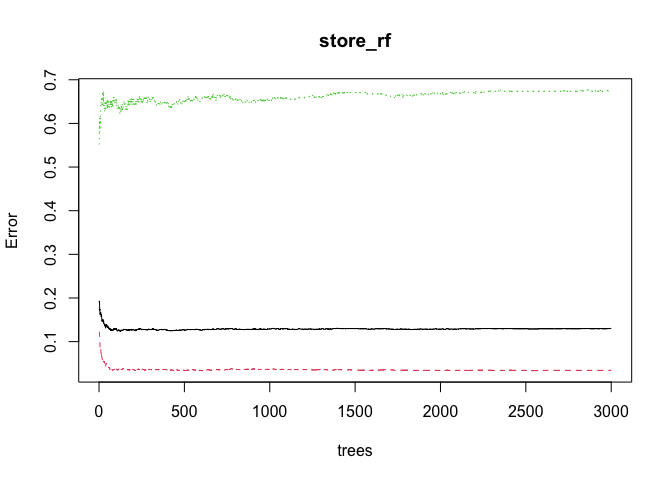
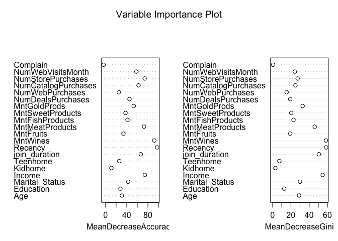

p09
================
Thomas Huang
2026-05-05

In this piece, I’m predicting whether individuals would purchase a
discounted premium membership at a supermarket with random forest. This
is the soruce of my dataset:
<https://www.kaggle.com/datasets/ahsan81/superstore-marketing-campaign-dataset/data>.

This is the code book:

Response (target) - 1 if customer accepted the offer in the last
campaign, 0 otherwise ID - Unique ID of each customer Year_Birth - Age
of the customer Complain - 1 if the customer complained in the last 2
years Dt_Customer - date of customer’s enrollment with the company
Education - customer’s level of education Marital - customer’s marital
status Kidhome - number of small children in customer’s household
Teenhome - number of teenagers in customer’s household Income -
customer’s yearly household income MntFishProducts - the amount spent on
fish products in the last 2 years MntMeatProducts - the amount spent on
meat products in the last 2 years MntFruits - the amount spent on fruits
products in the last 2 years MntSweetProducts - amount spent on sweet
products in the last 2 years MntWines - the amount spent on wine
products in the last 2 years MntGoldProds - the amount spent on gold
products in the last 2 years NumDealsPurchases - number of purchases
made with discount NumCatalogPurchases - number of purchases made using
catalog (buying goods to be shipped through the mail)
NumStorePurchases - number of purchases made directly in stores
NumWebPurchases - number of purchases made through the company’s website
NumWebVisitsMonth - number of visits to company’s website in the last
month Recency - number of days since the last purchase

The goal is to find out which are the most important predictors.

# Load packages and data

``` r
library(tidyverse);library(ggplot2);library(randomForest);library(REAT);library(partykit);library(caret)
```

    ## randomForest 4.7-1.2

    ## Type rfNews() to see new features/changes/bug fixes.

    ## 
    ## Attaching package: 'randomForest'

    ## The following object is masked from 'package:psych':
    ## 
    ##     outlier

    ## The following object is masked from 'package:dplyr':
    ## 
    ##     combine

    ## The following object is masked from 'package:ggplot2':
    ## 
    ##     margin

    ## 
    ## Attaching package: 'REAT'

    ## The following object is masked from 'package:psych':
    ## 
    ##     mssd

    ## The following object is masked from 'package:readr':
    ## 
    ##     spec

    ## Loading required package: libcoin

    ## Loading required package: mvtnorm

    ## 
    ## Attaching package: 'mvtnorm'

    ## The following object is masked from 'package:effectsize':
    ## 
    ##     standardize

    ## Loading required package: lattice

    ## 
    ## Attaching package: 'caret'

    ## The following object is masked from 'package:purrr':
    ## 
    ##     lift

``` r
store <- read.csv('superstore_data.csv')
```

# Data management

``` r
glimpse(store)
```

    ## Rows: 2,240
    ## Columns: 22
    ## $ Id                  <int> 1826, 1, 10476, 1386, 5371, 7348, 4073, 1991, 4047…
    ## $ Year_Birth          <int> 1970, 1961, 1958, 1967, 1989, 1958, 1954, 1967, 19…
    ## $ Education           <chr> "Graduation", "Graduation", "Graduation", "Graduat…
    ## $ Marital_Status      <chr> "Divorced", "Single", "Married", "Together", "Sing…
    ## $ Income              <int> 84835, 57091, 67267, 32474, 21474, 71691, 63564, 4…
    ## $ Kidhome             <int> 0, 0, 0, 1, 1, 0, 0, 0, 0, 0, 0, 1, 0, 0, 0, 1, 1,…
    ## $ Teenhome            <int> 0, 0, 1, 1, 0, 0, 0, 1, 1, 1, 0, 0, 0, 0, 1, 1, 1,…
    ## $ Dt_Customer         <chr> "6/16/2014", "6/15/2014", "5/13/2014", "11/5/2014"…
    ## $ Recency             <int> 0, 0, 0, 0, 0, 0, 0, 0, 0, 0, 0, 0, 0, 0, 0, 0, 0,…
    ## $ MntWines            <int> 189, 464, 134, 10, 6, 336, 769, 78, 384, 384, 450,…
    ## $ MntFruits           <int> 104, 5, 11, 0, 16, 130, 80, 0, 0, 0, 26, 4, 82, 10…
    ## $ MntMeatProducts     <int> 379, 64, 59, 1, 24, 411, 252, 11, 102, 102, 535, 6…
    ## $ MntFishProducts     <int> 111, 7, 15, 0, 11, 240, 15, 0, 21, 21, 73, 0, 80, …
    ## $ MntSweetProducts    <int> 189, 0, 2, 0, 0, 32, 34, 0, 32, 32, 98, 13, 20, 16…
    ## $ MntGoldProds        <int> 218, 37, 30, 0, 34, 43, 65, 7, 5, 5, 26, 4, 102, 3…
    ## $ NumDealsPurchases   <int> 1, 1, 1, 1, 2, 1, 1, 1, 3, 3, 1, 2, 1, 1, 0, 4, 4,…
    ## $ NumWebPurchases     <int> 4, 7, 3, 1, 3, 4, 10, 2, 6, 6, 5, 3, 3, 1, 25, 2, …
    ## $ NumCatalogPurchases <int> 4, 3, 2, 0, 1, 7, 10, 1, 2, 2, 6, 1, 6, 1, 0, 1, 1…
    ## $ NumStorePurchases   <int> 6, 7, 5, 2, 2, 5, 7, 3, 9, 9, 10, 6, 6, 2, 0, 5, 5…
    ## $ NumWebVisitsMonth   <int> 1, 5, 2, 7, 7, 2, 6, 5, 4, 4, 1, 4, 1, 6, 1, 4, 4,…
    ## $ Response            <int> 1, 1, 0, 0, 1, 1, 1, 0, 0, 0, 0, 0, 1, 0, 0, 0, 1,…
    ## $ Complain            <int> 0, 0, 0, 0, 0, 0, 0, 0, 0, 0, 0, 0, 0, 0, 0, 0, 0,…

``` r
store$Dt_Customer <- as.Date(store$Dt_Customer, format = "%m/%d/%Y")
store$join_duration <- as.numeric(difftime(Sys.Date(), store$Dt_Customer, units = "days"))
store$join_duration <- store$join_duration/365.25 - 1

store$Age <- 2023 - store$Year_Birth #Data from 2023

store$Education <- as.factor(store$Education)
store$Marital_Status <- as.factor(store$Marital_Status)
store$Response <- as.factor(store$Response)

glimpse(store)
```

    ## Rows: 2,240
    ## Columns: 24
    ## $ Id                  <int> 1826, 1, 10476, 1386, 5371, 7348, 4073, 1991, 4047…
    ## $ Year_Birth          <int> 1970, 1961, 1958, 1967, 1989, 1958, 1954, 1967, 19…
    ## $ Education           <fct> Graduation, Graduation, Graduation, Graduation, Gr…
    ## $ Marital_Status      <fct> Divorced, Single, Married, Together, Single, Singl…
    ## $ Income              <int> 84835, 57091, 67267, 32474, 21474, 71691, 63564, 4…
    ## $ Kidhome             <int> 0, 0, 0, 1, 1, 0, 0, 0, 0, 0, 0, 1, 0, 0, 0, 1, 1,…
    ## $ Teenhome            <int> 0, 0, 1, 1, 0, 0, 0, 1, 1, 1, 0, 0, 0, 0, 1, 1, 1,…
    ## $ Dt_Customer         <date> 2014-06-16, 2014-06-15, 2014-05-13, 2014-11-05, 2…
    ## $ Recency             <int> 0, 0, 0, 0, 0, 0, 0, 0, 0, 0, 0, 0, 0, 0, 0, 0, 0,…
    ## $ MntWines            <int> 189, 464, 134, 10, 6, 336, 769, 78, 384, 384, 450,…
    ## $ MntFruits           <int> 104, 5, 11, 0, 16, 130, 80, 0, 0, 0, 26, 4, 82, 10…
    ## $ MntMeatProducts     <int> 379, 64, 59, 1, 24, 411, 252, 11, 102, 102, 535, 6…
    ## $ MntFishProducts     <int> 111, 7, 15, 0, 11, 240, 15, 0, 21, 21, 73, 0, 80, …
    ## $ MntSweetProducts    <int> 189, 0, 2, 0, 0, 32, 34, 0, 32, 32, 98, 13, 20, 16…
    ## $ MntGoldProds        <int> 218, 37, 30, 0, 34, 43, 65, 7, 5, 5, 26, 4, 102, 3…
    ## $ NumDealsPurchases   <int> 1, 1, 1, 1, 2, 1, 1, 1, 3, 3, 1, 2, 1, 1, 0, 4, 4,…
    ## $ NumWebPurchases     <int> 4, 7, 3, 1, 3, 4, 10, 2, 6, 6, 5, 3, 3, 1, 25, 2, …
    ## $ NumCatalogPurchases <int> 4, 3, 2, 0, 1, 7, 10, 1, 2, 2, 6, 1, 6, 1, 0, 1, 1…
    ## $ NumStorePurchases   <int> 6, 7, 5, 2, 2, 5, 7, 3, 9, 9, 10, 6, 6, 2, 0, 5, 5…
    ## $ NumWebVisitsMonth   <int> 1, 5, 2, 7, 7, 2, 6, 5, 4, 4, 1, 4, 1, 6, 1, 4, 4,…
    ## $ Response            <fct> 1, 1, 0, 0, 1, 1, 1, 0, 0, 0, 0, 0, 1, 0, 0, 0, 1,…
    ## $ Complain            <int> 0, 0, 0, 0, 0, 0, 0, 0, 0, 0, 0, 0, 0, 0, 0, 0, 0,…
    ## $ join_duration       <dbl> 10.88501, 10.88775, 10.97810, 10.49624, 10.75086, …
    ## $ Age                 <dbl> 53, 62, 65, 56, 34, 65, 69, 56, 69, 69, 76, 44, 64…

# Impute missing values

``` r
set.seed(4959)
store_imputed <- rfImpute(Response ~
          Age + Education + Marital_Status + Income + Kidhome + Teenhome + join_duration + Recency
          + MntWines + MntFruits + MntMeatProducts + MntFishProducts + MntSweetProducts + MntGoldProds
          + NumDealsPurchases + NumWebPurchases + NumCatalogPurchases + NumStorePurchases + NumWebVisitsMonth + Complain,
          data = store)
```

    ## ntree      OOB      1      2
    ##   300:  12.68%  2.20% 72.46%
    ## ntree      OOB      1      2
    ##   300:  12.63%  2.36% 71.26%
    ## ntree      OOB      1      2
    ##   300:  12.23%  2.20% 69.46%
    ## ntree      OOB      1      2
    ##   300:  12.81%  2.36% 72.46%
    ## ntree      OOB      1      2
    ##   300:  12.46%  2.31% 70.36%

# Run random forest

``` r
set.seed(4959)
store_rf <- randomForest(Response ~
          Age + Education + Marital_Status + Income + Kidhome + Teenhome + join_duration + Recency
          + MntWines + MntFruits + MntMeatProducts + MntFishProducts + MntSweetProducts + MntGoldProds
          + NumDealsPurchases + NumWebPurchases + NumCatalogPurchases + NumStorePurchases + NumWebVisitsMonth + Complain,
          ntree = 3000,
          importance = TRUE,
          proximity = TRUE,
          keep.forest = TRUE,
          keep.inbag = TRUE,
          mtry = 50, #These are default settings of the function
          data = store_imputed) 
```

    ## Warning in randomForest.default(m, y, ...): invalid mtry: reset to within valid
    ## range

# See if there are enough trees

Looks good.

``` r
plot(store_rf)
```

<!-- -->

# Evaluate model performance

Accuracy = .871. Not bad.

``` r
# Predicted outcomes
store_predicted <- predict(store_rf, OOB = TRUE, predict.all = TRUE, proximity = TRUE) %>% 
  as.data.frame() %>% 
  rownames_to_column(var = "Number") %>% 
  as_tibble()

# Confusion matrix
set.seed(4959)
caret::confusionMatrix(store_predicted$pred, store_imputed$Response, positive = '1')
```

    ## Confusion Matrix and Statistics
    ## 
    ##           Reference
    ## Prediction    0    1
    ##          0 1840  226
    ##          1   66  108
    ##                                          
    ##                Accuracy : 0.8696         
    ##                  95% CI : (0.855, 0.8833)
    ##     No Information Rate : 0.8509         
    ##     P-Value [Acc > NIR] : 0.006225       
    ##                                          
    ##                   Kappa : 0.3598         
    ##                                          
    ##  Mcnemar's Test P-Value : < 2.2e-16      
    ##                                          
    ##             Sensitivity : 0.32335        
    ##             Specificity : 0.96537        
    ##          Pos Pred Value : 0.62069        
    ##          Neg Pred Value : 0.89061        
    ##              Prevalence : 0.14911        
    ##          Detection Rate : 0.04821        
    ##    Detection Prevalence : 0.07768        
    ##       Balanced Accuracy : 0.64436        
    ##                                          
    ##        'Positive' Class : 1              
    ## 

# Calculate variable importance

This automatically returns an ugly plot. Please ignore.

``` r
vimp <- randomForest::varImpPlot(store_rf,
                         sort=FALSE,
                         main="Variable Importance Plot") %>% 
  as.data.frame()
```

<!-- -->

``` r
vimp <- vimp %>% 
  as.data.frame %>% 
  rownames_to_column(var = "Variable") %>% 
  as_tibble()

vimp #Both mean decrease in accuracy and mean decrease Gini represent variable importance. I will use the former because decrease in accuracy is used as the loss function in training.
```

    ## # A tibble: 20 × 3
    ##    Variable            MeanDecreaseAccuracy MeanDecreaseGini
    ##    <chr>                              <dbl>            <dbl>
    ##  1 Age                                30.7            29.0  
    ##  2 Education                          28.1            12.7  
    ##  3 Marital_Status                     42.6            29.9  
    ##  4 Income                             74.3            54.7  
    ##  5 Kidhome                            11.0             2.92 
    ##  6 Teenhome                           25.9             7.36 
    ##  7 join_duration                      66.5            50.5  
    ##  8 Recency                            97.5            58.6  
    ##  9 MntWines                           92.1            58.3  
    ## 10 MntFruits                          33.9            19.3  
    ## 11 MntMeatProducts                    72.7            46.0  
    ## 12 MntFishProducts                    41.5            22.9  
    ## 13 MntSweetProducts                   37.7            20.3  
    ## 14 MntGoldProds                       53.3            32.8  
    ## 15 NumDealsPurchases                  45.2            19.2  
    ## 16 NumWebPurchases                    25.0            15.3  
    ## 17 NumCatalogPurchases                62.3            24.9  
    ## 18 NumStorePurchases                  73.9            27.3  
    ## 19 NumWebVisitsMonth                  58.2            24.2  
    ## 20 Complain                           -3.67            0.573

``` r
color_scheme <- ifelse(vimp$MeanDecreaseAccuracy < 0, "pink", "lightblue")

vimp_plot <- ggplot(vimp, aes(x = reorder(Variable, MeanDecreaseAccuracy), y = MeanDecreaseAccuracy)) +
  geom_bar(stat = "identity",
           show.legend = FALSE,
           fill = color_scheme,     
           color = "white",
           width = 1) +
  geom_hline(yintercept = 0, color = 1, lwd = 0.2) +
  geom_text(aes(label = Variable, # Text with groups
                hjust = ifelse(MeanDecreaseAccuracy < 0, 1.2, -0.5),
                vjust = 0.3), size = 4) +
  xlab("Variable") +
  ylab("Mean Decrease in Accuracy") +
  scale_y_continuous(breaks = seq(-10, 100, by = 10),
                     limits = c(-20, 100)) +
  coord_flip() +
  theme_minimal() +
  theme(axis.text.y = element_blank(), 
        axis.ticks.y = element_blank(), 
        panel.grid.major.y = element_blank())

ggsave("vimp_plot.png", plot = vimp_plot, width = 24, height = 4)
```

Takeaway: Target those who visited recently, spent a lot on wine, and
rich.
